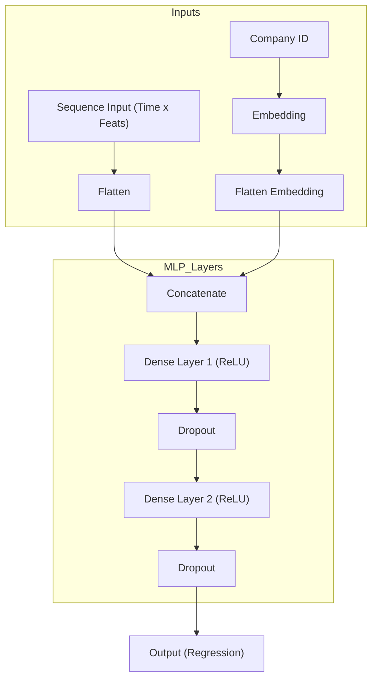
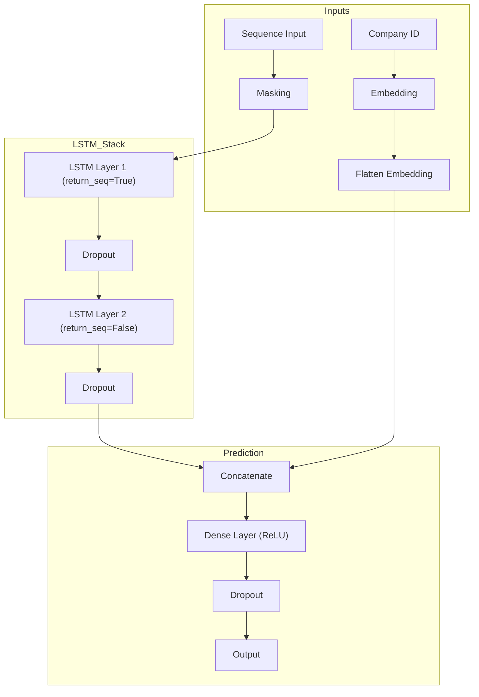
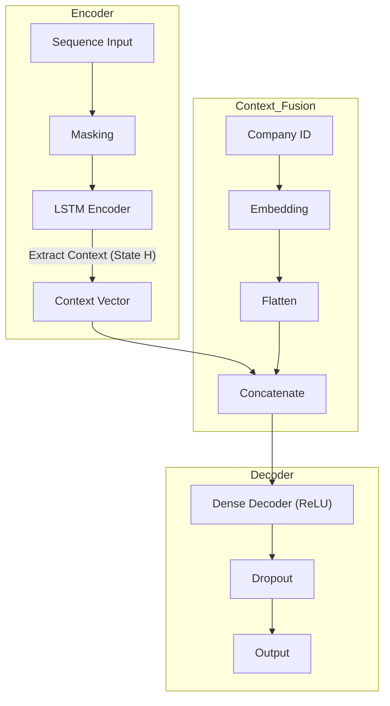
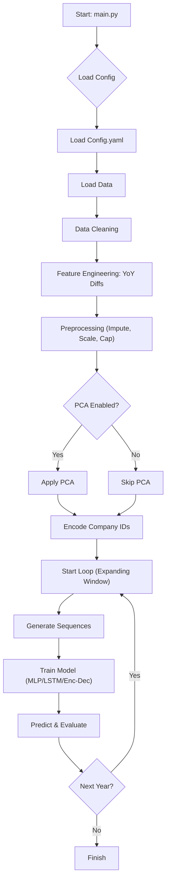

# FidelFolio DL Valuation Project

Modular Deep Learning pipeline for predicting market capitalization growth of listed companies using fundamental financial indicators.

## Project Structure

```text
FidelFolio_Project/
├── config/
│   └── config.yaml           # Hyperparameters & settings
├── data/
│   └── FidelFolio_Dataset.csv # [REQUIRED] Place your dataset here
├── experiments/              # Original Jupyter Notebooks
├── src/                      # Source code
│   ├── data/                 # Loading & Preprocessing
│   ├── features/             # Feature Engineering & Sequences
│   ├── models/               # MLP, LSTM, Encoder-Decoder Architectures
│   └── utils/                # Utilities
├── main.py                   # CLI Entry Point
├── pyproject.toml            # Build configuration
└── setup.py                  # Setup script
```

## Setup

1. **Install Dependencies**:
   ```bash
   pip install -e .
   ```

2. **Data Setup**:
   Place your `FidelFolio_Dataset.csv` file into the `data/` directory.

## Usage

Run the training pipeline using `main.py`:

```bash
# Run the pipeline (uses config/config.yaml by default)
python main.py

# Run with a specific configuration file (e.g. for testing)
python main.py --config config/test_config.yaml
```

To switch models (MLP / LSTM / Encoder-Decoder), edit `model_type` in `config/config.yaml`.

## Configuration

Modify `config/config.yaml` to adjust:
- `preprocessing`: Imputation neighbors, outlier capping thresholds, PCA parameters.
- `models`: Layer sizes, dropout rates, embedding dimensions.
- `training`: Epochs, batch size, learning rate.

## Models Implemented

### 1. MLP (Multi-Layer Perceptron)
A traditional feed-forward network that flattens time-series data into a single vector, combined with learned company embeddings.



### 2. LSTM (Long Short-Term Memory)
A Recurrent Neural Network (RNN) designed to capture temporal dependencies in financial data.



### 3. Encoder-Decoder
Uses an LSTM as an encoder to compress the time-series context into a hidden state, which is then passed to a Dense decoder for prediction.



## Pipeline Flow


